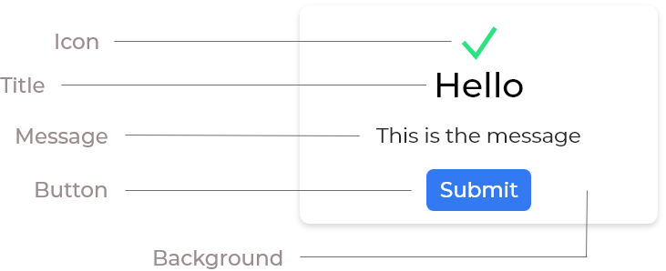

# 🅰 Alerts JS

[](https://travis-ci.org/utkarshdubey/alerts-js)
[](https://coveralls.io/github/utkarshdubey/alerts-js?branch=master)
[](https://github.com/utkarshdubey/alerts-js/blob/master/LICENSE)


<p align="center">
  
</p>

AlertsJS is a **simple, easy** way of displaying beautiful **alerts and popups** updated weekly in our curated list
including designs of various **frameworks** and **libraries**. 😎

You can integrate it in your website with using just a single `<script>
  ` tag, Additional options are available, but not required since you can use our free webservice to display alerts/popups without configuring Javascript.

## 💡 Why AlertsJS?
Because it provides a simple, unobtrusive web interface to display beautiful alerts and popups with just one `
  `<script>`
  ` tag, without having any prior knowledge of javascript. You can also -
- Create forms and collect data by integrating various plugins and or services such as MailChimp 📬 or our own service.
- You can choose any of your favorite libraries such as micromodal.js or Sweetalerts.js right through the configurations and have a variety of over 200+ such libraries and plugins including our **custom made** one's.
- We are tiny, which means no need to load Jquery and all the inessential things. You'll only include what you need.
- Authenticating securely to display popups/alerts through the web interface to your website.
- Integrating things such as 🔗 download links on payment through PayPal or Stripe. It also offers various integrations. Look at [integrations](#integrations) for more information.
- It will remain open-source forever, but to keep it running and maintaining it you can help us by donating us on 💷💷[PayPal](https://www.paypal.me/udicon).

## 👨‍🏫 Installation
To install and use the library, you can simple download the minified JS file from ```dist/alerts.js``` and include it in your html files.

To initialize the alert. You can do so simply by:
```js
const brandNewAlert = new Alert({
  // Your options here 😉
})
```

Then using is as simple as:
```js
brandNewAlert.alert();
```

For more information on all the available properties and options. Please check .

***Want to check what's new?***. Check the .

## 🧑 Contributing
We'd love if you help us by fixing a bug, or creating a whole new modal theme from scratch. Every small contribution counts towards a big release. You can join our official **Discord** Server 😳 [here](https://discord.gg/YvgEPre). Feel free to create a pull request if you think we did something 👎 wrong.

## 👥 Use Cases
AlertsJS can be used by anyone and everyone as its flexible and adjusts according to the situation. If you aren't interested in writing Javascript code, you can use our Web Interface with which you could configure all the settings which you could do while writing JS. But if you want to have even more control and write JS. Don't worry we have the open-source library with which you could build your own alerts/popups and customize it according to your needs.
## 🚛 The Open-Source Process
Since the development is open-source, we want to add as many contributors as possible, We also are in need of moderators for curating the list weekly. The process would be simple:-
- 1️⃣ Moderators choose and approve various alert/popup libraries based on their stability and design.
- 2️⃣ The then approved libraries would be added to the Global Package Index (GPI) with which it is accessible through the AlertsJS library.
- 3️⃣ The curated list thus is updated weekly in the same manner. Note that only opensource libraries are added to the **GPI**.

## 📄 Documentation

You can use the following options 👂 in the constructor:
```js
  const alert = new Alert({
    title: 'Awesome Alert', // The title of modal.
    message: 'This is another awesome alert made using AlertsJS', // Content to display.
    icon: 'success', // A success or an error, custom icons are upcoming
    timeout: 5, // Set a timeout after the modal has been opened. Time in seconds.
    action: {
      type: 'link', // The link you want to redirect to... more actions are coming
      redirect: '/purchase/success', // Link where you want to redirect
    },
    button: { // Button configurations
      type: 'submit', // Type of the button [submit, reset]
      text: 'Get me flyin!', // Button text
      action: { // Actions on the button
        type: 'link', // The link you want to redirect to... more actions are coming
        redirect: 'https://google.com' // Link where you want to redirect
      }
    },
    customHTML: { // Custom HTML Arrives
      content: `
          <form action="/" method="POST">
              <input type="text" placeholder="Your name" style="color:red;" />
              <input type="submit" value="Subscribe me!" />
          </form>
          ` // Wrap everything inside the `` backticks.         
    },
    closeButtonText: 'Close this thingy', // The close button text.
  });

```

You can call the alert with a 🛴 simple function:

```js
    ...
    alert.alert();

```
Or through an 👆 onclick event:

```html
    <input type = "button"
      onclick = "alert.alert()"
      value = "Click me" />
```

### Properties


|Property Name| Property Description  |
|--|--|
| title | The title of the modal. It is a required field. |
| message | The message of the modal. It is a required field. It can render HTML too. |
| icon | An icon to display when the message pops-up. Currently the options available are `success` and `error`, Custom icons are coming soon.|
| action | It has two properties, `type` and `redirect`. Currently the type is only `link`. |
| timeout | Timeout to close the modal after **N** number of **seconds** |
| button | It has three properties, `type`, `text`(required) and `action`. Type could be `submit`, `reset`, etc. `action` is same as in above |
| customHTML | It has one property named `content` which would take in all the html you want in the modal. |
| closeButtonText | The text to display on the close button |


##  ✏ To-Do
- [x] Make it work
- [x] Example Modal
  - [x] Add CSS effects, such as fadeIn, etc. to the modal
  - [x] Create a nice, good looking button with good animations.
  - [x] Better and nice looking modal design.
- [x] Add more properties.
- Custom HTML
  - [x] Through Javascript
  - [ ] Through HTML
- [ ] MailChimp and work on other integrations.
- [x] Work on designer and developer documentation for creating custom themes. 
- [ ] Create the API and Global Index. Create the "**Pick from Global Index**" feature. 
- [ ] Create separate theme pages, like npm packages.
- [ ] A nice landing page. 


## 💻 Developer Documentation
If you want you can even create your own themes and publish them to the **Global Index** for others to use or simply use in your own project.

### 🏓 Structure

The current design structure of the modal is below. You can always add effects and other extra animations like progress bars. Or even use a Bootstrap + Swatch theme to create a simple alert. Whatever you make, please refrain the use of other **JS** frameworks such as **Jquery***. We are ~~lamely~~ really strict on what's taking resources.

<p align="center">
  
</p>

If you are a designer looking to develop the design into code. You can do very easily by using classes as mentioned below. We sincerely follow the [BEM Convention](http://getbem.com/naming/).

| Class Name | Class Description |
|--|--|
| `@keyframes fadeIn` | The fadeIn effect keyframe. You can set up the opacity and other things using it while the popup fades in. |
| `@keyframes fadeOut` | The fadeOut effect keyframe. You can set up the opacity and other things using it while the popup fades out. |
| `AlertsJS__fadeOut` | Add this class with the opacity you want and tinker with it. |
| `AlertsJS__overlay` | The overlay behind the modal when modal appears. You can play with it and add background effects or colors. |
| `.AlertsJS__alert` | The main alert box which appears when the button is clicked. You can play with colors, buttons, inputs and everything inside it. |
| `.AlertsJS__customHTML` | Style for custom HTML which includes input boxes, buttons, iframes or anything else |

## 🌎 Global Index
Global Index, is the global CDN powered by ☁ Cloudflare where all the themes made by developer/designers would be published. It will be hosted on the website(coming really soon). Utilizing Cloudflare's pre cache system. Loading CSS would be ultra-fast. API's coming soon. For development of theme look at [Development](#-development).

## 👩‍💻 Development
You can add custom Javascript effects in background or on any other elements. The only thing is you aren't 🚫 allowed to use JQuery. A possible workaround for JQuery is to use only the code required from JQuery by copying it, instead of requiring the whole file.

**We don't hold any responsibility or any claims over copyright issues of certain libraries.** Even though strict checking would be done before publishing themes.

## 🎉 Publish Theme
To publish the theme, you can contact one of the main contributors and send them a ZIP file containing the CSS/JS code you made. The theme would only be added to the [Global Index](#-global-index) after it qualifies certain criteria, which is:

- No copyrighted material.
- Clean and minified CSS files.
- Use of proper comments in JS files.
- Better loading optimizations done pre-hand.

After you have qualified these criterias. ✅ Your theme would be approved and is now published to the Global Index. Now for anyone to use it, they can either download the files or add a name in the themes option like this:
```js
theme:{
  name: 'yourThemeName', // 📛 The name of your theme, published.
  src: './css/yourThemeName.css' // 🥅 Source of the CSS file, if you want to store the theme files on your own server.
}
```

## ❓ FAQ

### Is it free? Are there any hidden costs? 🆓
It's absolutely **free** and infact the developer code is **open-source**. Do what you want to, hack, break, distribute, we aren't sueing you.

### How will you make money? 💰💰💰
We won't. But we require money for hosting the Web Interface, so we depend on donations and sponsorers. If you want to donate us, you could do it on [PayPal](https://www.paypal.me/udicon) or Join our Discord Server for perks, for sponsoring please contact us
[here](https://utkarsh.co).

### I want a library added, could you do it? 😁
You could add a request to add your library on the website. Please note that the library is open-source before submitting it. It would be then moderated by the moderators. Finally, if approved. Taki Taki 🙌.
### So could I join and help? ✌
Yes ofcourse, we are pleased to have you on board. Contact us [here](https://utkarsh.co). The development has started, we are in need of good designers and developers.
